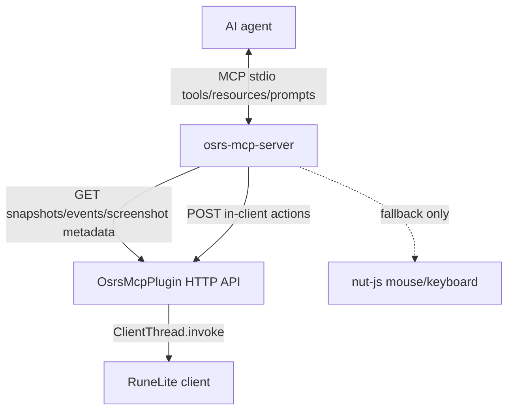

# OSRS RuneLite MCP

Local MCP bridge for controlling Old School RuneScape through official RuneLite.

The project has two pieces:

- `osrs-mcp-plugin`: a RuneLite plugin that exposes local HTTP endpoints on `localhost:8080` through `localhost:8090`.
- `osrs-mcp-server`: a TypeScript MCP server that Codex starts over stdio and exposes OSRS tools, resources, and prompts.

## Architecture



The preferred action path is in-client RuneLite menu actions. OS mouse and keyboard are kept as fallback for UI cases where RuneLite does not expose enough action metadata.

## Build And Load

Build everything without touching RuneLite:

```powershell
.\Build-OSRS-MCP.bat
```

Build and copy the plugin jar without starting or closing RuneLite:

```powershell
.\Install-OSRS-MCP-Plugin.bat
```

Start RuneLite with the local development plugin classpath only when RuneLite is not already running:

```powershell
.\Start-OSRS-MCP.bat
```

Use the restart script only when you intentionally want the script to close and relaunch RuneLite:

```powershell
.\Restart-OSRS-MCP.bat
```

After load, verify:

```text
http://localhost:8080/api/identity
```

If port `8080` is busy, the plugin tries through `8090`.

## MCP Registration

Codex should have a separate MCP entry for this project:

```toml
[mcp_servers.osrs_mcp_server]
command = 'C:\Program Files\nodejs\node.exe'
args = ['H:\runelite-mcp\osrs-mcp-server\build\index.js']
startup_timeout_sec = 30
```

Do not reuse or overwrite the older `osrs_runelite` entry.

## AI Playbook

For normal play loops:

1. Read `osrs://client/identity` and `osrs://snapshot/latest`.
2. Prefer `interact_with` or `click_*` with an `option` so the MCP server opens the context menu and invokes RuneLite's real menu params.
3. Use `perform_until` for repeated skilling loops, such as chopping until inventory full.
4. Use `handle_dialogue` for NPC/player dialogue.
5. Use `eat_food_when` for HP safety.
6. Verify actions with `verify_after_action`, `wait_until_idle`, `wait_until_location`, `wait_for_chat_message`, or `get_recent_events`.
7. Use `capture_canvas_screenshot` for visual confirmation around tricky widgets or suspicious coordinates.

Raw `move_mouse_and_click` should be the last resort.

OS fallback mouse movement is humanized by default with a short Bezier path and pre-click delay. Inspect it with `get_input_profile`; disable it by setting `OSRS_HUMANIZE_MOUSE=false` before starting the MCP server.

## Current Known Gap

Long-distance navigation is still a fallback straight-line/minimap system. The next major reliability upgrade is collision-aware pathfinding, ideally by bridging RuneLite's Shortest Path plugin or a local scene collision-map A*.
