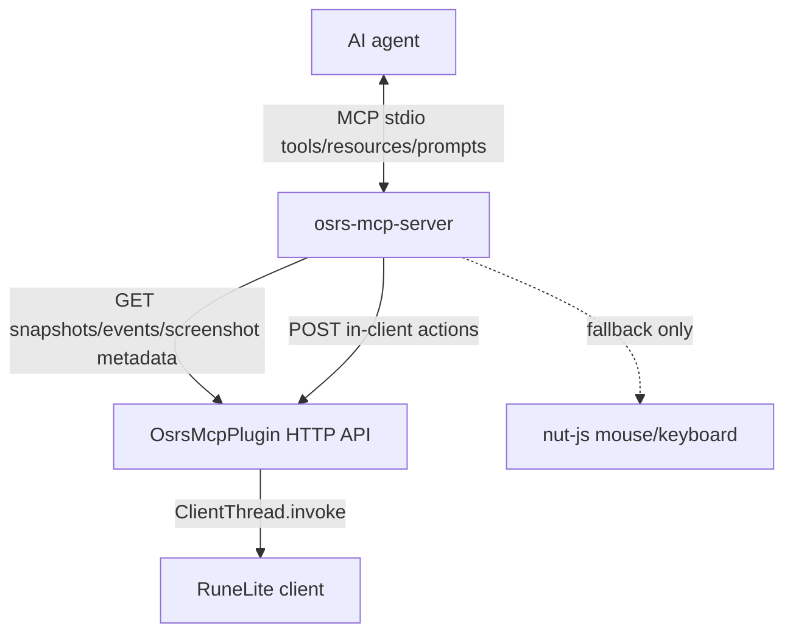

# OSRS RuneLite MCP

Local MCP bridge for controlling Old School RuneScape through official RuneLite.

The project has two pieces:

- `osrs-mcp-plugin`: a RuneLite plugin that exposes local HTTP endpoints on `localhost:8080` through `localhost:8090`.
- `osrs-mcp-server`: a TypeScript MCP server that Codex starts over stdio and exposes OSRS tools, resources, and prompts.

## Architecture



The preferred action path is in-client RuneLite menu actions. OS mouse and keyboard are kept as fallback for UI cases where RuneLite does not expose enough action metadata.

## Build And Load

Build everything without touching RuneLite:

```powershell
.\Build-OSRS-MCP.bat
```

Build and copy the plugin jar without starting or closing RuneLite:

```powershell
.\Install-OSRS-MCP-Plugin.bat
```

Start RuneLite with the local development plugin classpath only when RuneLite is not already running:

```powershell
.\Start-OSRS-MCP.bat
```

Use the restart script only when you intentionally want the script to close and relaunch RuneLite:

```powershell
.\Restart-OSRS-MCP.bat
```

After load, verify:

```text
http://localhost:8080/api/identity
```

If port `8080` is busy, the plugin tries through `8090`.

Verify the MCP server contract without touching RuneLite:

```powershell
cd H:\runelite-mcp\osrs-mcp-server
npm run build
npm run smoke:plugin
npm run smoke:planner
npm run smoke:agent-context
npm run smoke:mcp
```

Use `npm run smoke:mcp -- --live` only when RuneLite is already running with the plugin loaded and you want the smoke test to require a discovered client. `smoke:plugin` validates action endpoints with `dryRun: true`; it does not click or invoke actions.

## MCP Registration

Codex should have a separate MCP entry for this project:

```toml
[mcp_servers.osrs_mcp_server]
command = 'C:\Program Files\nodejs\node.exe'
args = ['H:\runelite-mcp\osrs-mcp-server\build\index.js']
startup_timeout_sec = 30
```

Do not reuse or overwrite the older `osrs_runelite` entry.

## AI Playbook

For normal play loops:

1. Start with `observe_game` when you want the AI's whole read-only perception packet in one call: compact context, optional plan/package, and optional screenshot metadata/image. It never executes actions.
2. Use `run_agent_cycle` for one safe control-loop pass: observe, plan, select the next step, and validate it without executing.
3. Use `get_agent_context` when you only need the compact state bundle: identity, runtime freshness, player state, risks, nearby targets, dialogue, chat, and recommended checks.
4. Use `plan_next_action` when you want a conservative ordered tool-call plan for an objective before executing anything. It covers common safe routines such as woodcutting, mining, fishing, banking/deposit, dialogue, combat opening, and ground-item pickup.
5. Use `prepare_agent_step` when you want the next plan packaged with safety flags, the first action, baseline guidance, and verification guidance.
6. Use `validate_prepared_step` immediately before acting when you need a fresh target check or a `dryRun:true` validation for raw `invoke_*` params.
7. Read `osrs://client/identity` and `osrs://snapshot/latest` when you need the full raw context.
8. Run `diagnose_runtime` after rebuilding the plugin or when a Java endpoint reports 404; it will tell you if RuneLite is still running an older plugin copy.
9. Prefer `interact_with` or `click_*` with an `option` so the MCP server opens the context menu and invokes RuneLite's real menu params.
10. Use `perform_until` for repeated skilling loops, such as chopping until inventory full.
11. Use `handle_dialogue` for NPC/player dialogue.
12. Use `eat_food_when` for HP safety.
13. For risky actions, call `mark_action_baseline` before acting, then `verify_last_action` to prove snapshot deltas such as inventory, location, dialogue, chat, or entity-count changes.
14. Verify single expected conditions with `verify_after_action`, `wait_until_idle`, `wait_until_location`, `wait_for_chat_message`, or `get_recent_events`.
15. Use `get_screenshot` or `capture_canvas_screenshot` for visual confirmation around tricky widgets or suspicious coordinates.
16. Use `get_widgets` with a narrow filter when a complex interface needs generic widget ids, actions, bounds, and click coordinates.
17. Use `walk_route_to` when the destination tile is known; use `calculate_path_to` for inspection and `walk_path_to` for one cautious step.

Raw `move_mouse_and_click` should be the last resort.

For tick-sensitive sequences, use `wait_for_game_tick` or pass `tickAligned: true` to direct `invoke_*` tools so the action is sent just after a fresh OSRS game tick.

OS fallback mouse movement is humanized by default with a short Bezier path and pre-click delay. Inspect it with `get_input_profile`; disable it by setting `OSRS_HUMANIZE_MOUSE=false` before starting the MCP server.

## Current Known Gap

Loaded-scene navigation now has a local collision-map A* exposed through `/api/path` and used by `calculate_path_to`, `walk_path_to`, and `walk_route_to`. `walk_route_to` re-plans after each bounded movement step. Long-distance routing beyond the loaded scene still falls back to bounded minimap steps; the next major reliability upgrade is a wider route planner, ideally by bridging RuneLite's Shortest Path plugin if a stable integration surface is available.
