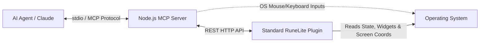

# OSRSMCP (RuneLite MCP Server) Implementation Plan

This document outlines the architecture and steps to build a Model Context Protocol (MCP) server for Old School RuneScape (OSRS) via RuneLite. 

## User Review Required

> [!TIP]
> **The "Hybrid Computer Use" Approach (Ban-Safe)**
> We will use a hybrid approach to allow the AI to play the game without triggering ban-detection:
> 1. **Perfect State (No Vision Needed):** We build a Standard RuneLite plugin. Its only job is to read the exact game state from memory (inventory, nearby NPCs, objects, **and UI dialogues**) and calculate their exact 2D X/Y screen coordinates on your monitor.
> 2. **External Actions:** The Node.js MCP server receives these exact coordinates over the local API.
> 3. **OS-Level Controls:** Using inspiration from projects like `Windows-MCP`, the Node.js server takes control of your actual computer mouse and keyboard at the OS level to click and type smoothly.

## How the AI Understands Dialogues and Quests

You asked a fantastic question: *How will the AI talk to characters on Tutorial Island or type a name?*

RuneScape's entire user interface—including the chatbox, NPC dialogues, the username creation screen, and quest journals—is built using **Widgets**. The RuneLite API allows us to perfectly read the text and state of any Widget on the screen.

**Here is the loop for talking to an NPC:**
1. **Reading the Dialogue:** The RuneLite Plugin checks for open Widgets. It detects an NPC dialogue and reads the exact text: *"RuneScape Guide: Welcome to RuneScape! Before you can get started, you need to create a name."*
2. **Identifying Options:** The plugin also finds the "Click here to continue" button or any dialogue choices (e.g., "1. Yes", "2. No") and calculates their exact X/Y screen coordinates.
3. **Sending to AI:** The plugin sends this text and coordinate data back to the AI via the MCP Server.
4. **AI Decision:** The AI reads the text, understands it's in a conversation, and decides to click "Continue". It tells the MCP Server: `click(x, y)`.
5. **Typing Text:** When the AI reaches the Name Creation screen, the plugin tells the AI: *"Widget 'Enter name:' is active."* The AI then uses an OS-level keyboard command `type_text("MyCoolBot123")` and presses Enter.

Because we are extracting the exact text directly from the game's memory, the AI doesn't need to struggle with reading blurry text from screenshots. It gets the dialogue handed to it perfectly as a string!

## Architecture

## Proposed Changes

### 1. RuneLite Plugin (Java)
We will create a standard RuneLite plugin project structure using Gradle.
#### [NEW] `h:/runelite-mcp/osrs-mcp-plugin/build.gradle`
Configures the standard RuneLite API dependencies.
#### [NEW] `h:/runelite-mcp/osrs-mcp-plugin/src/main/java/com/osrsmcp/OsrsMcpPlugin.java`
The main plugin class. It will start a local HTTP server on port `8080`.
#### [NEW] `h:/runelite-mcp/osrs-mcp-plugin/src/main/java/com/osrsmcp/ApiServer.java`
Serves endpoints that project 3D game coordinates to 2D screen coordinates using `Perspective.localToCanvas`, and extracts Widget text:
- `GET /api/state`: Returns player stats and state.
- `GET /api/inventory`: Returns items and their screen X/Y.
- `GET /api/entities`: Returns nearby NPCs/Objects and their screen X/Y.
- **`GET /api/dialogue`**: Reads the `Widget` system to return any currently open NPC text, player text, or dialogue choices, along with the screen X/Y bounds of the buttons to click.

### 2. MCP Server (Node.js/TypeScript)
We will create a Node.js project for the MCP server.
#### [NEW] `h:/runelite-mcp/osrs-mcp-server/package.json`
Dependencies: `@modelcontextprotocol/sdk`, `axios`, `typescript`, and an OS automation library like `@nut-tree/nut-js` (or similar tools from `Windows-MCP`).
#### [NEW] `h:/runelite-mcp/osrs-mcp-server/src/index.ts`
Initializes an `McpServer` over stdio. Registers tools for the AI:
- `get_game_state`: Fetches game data.
- `get_dialogue_state`: Checks if the player is currently in a conversation and what options are available.
- `move_mouse_and_click`: Uses OS automation to move the mouse and click.
- `type_text`: Uses OS automation to type characters on the keyboard (for naming accounts, chatting, etc.).

## Verification Plan

### Automated Tests
- Test the local HTTP API to ensure it correctly extracts dialogue text when an NPC is spoken to.

### Manual Verification
1. Build and load the Java plugin into standard RuneLite.
2. Start the Node.js MCP server.
3. Log into an account and talk to the Lumbridge Guide (or any NPC).
4. Ask the AI: "What is the NPC saying to me right now?"
5. The AI should fetch the dialogue state and reply with the exact text the NPC is saying.
6. Ask the AI: "Click continue to progress the dialogue." The AI will click the specific X/Y coordinate of the continue button.
