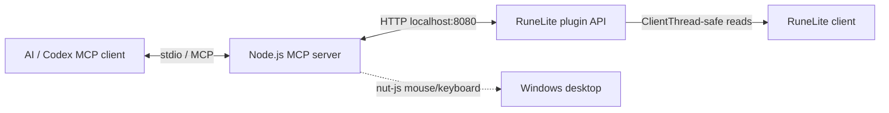

# OSRS MCP Implementation Plan And Runbook

This project connects RuneLite game-state reads to a local Model Context Protocol server. The working design is a three-part loop:

1. RuneLite plugin reads game state on the RuneLite client thread.
2. Local HTTP API exposes JSON at `http://localhost:8080/api/...`.
3. TypeScript MCP server turns those endpoints into AI tools and uses `nut-js` for OS-level mouse/keyboard actions.

Automation may be against game rules depending on how it is used. This project should be treated as a local technical integration, not a guarantee of account safety.

## Current Architecture



## RuneLite Plugin

Main files:

- `osrs-mcp-plugin/src/main/java/com/osrsmcp/OsrsMcpPlugin.java`
- `osrs-mcp-plugin/src/main/java/com/osrsmcp/ApiServer.java`

Important implementation details:

- `ClientThread` is injected into `OsrsMcpPlugin` and passed to `ApiServer`.
- Every RuneLite API read in HTTP handlers runs through `clientThread.invoke(...)` and a timeout-backed `CompletableFuture`.
- Timeout/failure responses are controlled JSON errors instead of uncaught thread exceptions.
- `ItemManager` is injected for item names.
- Game object names come from `client.getObjectDefinition(obj.getId()).getName()`.
- NPC names use `npc.getName()` with definition fallback.

## HTTP Endpoints

- `GET /api/` - endpoint index
- `GET /api/state` - player login status, name, health, run energy, world location
- `GET /api/inventory` - item IDs, names, quantities, slots
- `GET /api/npcs` - nearby NPCs, names, world location, click coordinates
- `GET /api/dialogue` - NPC/player dialogue, options, continue/options coordinates
- `GET /api/objects` - scene objects, names, world location, click coordinates
- `GET /api/grounditems` - ground item IDs, names, quantities, locations
- `GET /api/bank` - bank item IDs, names, quantities, slots
- `GET /api/equipment` - equipment item IDs, names, quantities, slots
- `GET /api/skills` - real level, boosted level, XP
- `GET /api/debug/coordinates` - canvas origin, canvas size, DPI transform, mouse position, player coordinate debug

## Coordinate Contract

For clickable game entities:

- `rawCanvasX/rawCanvasY` are the raw `Perspective.localToCanvas(...)` projection.
- `canvasX/canvasY` are the selected click target inside the RuneLite canvas.
- `screenX/screenY` are absolute desktop coordinates for `nut-js`.
- `screenX/screenY` are only emitted when the target point is inside the visible RuneLite canvas.
- `coordinateWarning` explains why click-ready coordinates are missing.

Object and NPC targeting:

- Game objects use `obj.getClickbox()` and click the center of the clickbox bounds.
- NPCs use `npc.getConvexHull()` and click the center of the hull bounds.
- Objects/NPCs do not fall back to unsafe tile/local-point coordinates for `screenX/screenY`.
- Ground items still use tile local point coordinates because RuneLite does not expose the same object clickbox shape for them in this implementation.

DPI/window behavior:

- The plugin records `canvasOriginX/canvasOriginY` from `client.getCanvas().getLocationOnScreen()`.
- Screen coordinates are derived from canvas origin plus canvas target, adjusted by the Java graphics transform for DPI scaling.
- RuneLite does not need to be fullscreen. Coordinates were verified with the canvas at `(1120, 28)` and size `792x1007`.
- If RuneLite is minimized/off-screen, `screenX/screenY` are withheld and `coordinateWarning` is returned.

## MCP Server

Main file:

- `osrs-mcp-server/src/index.ts`

Tools:

- `get_game_state`
- `get_inventory`
- `get_npcs`
- `get_dialogue`
- `get_game_objects`
- `get_ground_items`
- `get_bank`
- `get_equipment`
- `get_skills`
- `get_coordinate_debug`
- `move_mouse_and_click`
- `type_text`
- `press_key`

Runtime configuration:

- `OSRS_MOUSE_SPEED`, default `300`
- `OSRS_RUNELITE_API`, default `http://localhost:8080/api`
- `OSRS_API_TIMEOUT_MS`, default `3000`

`move_mouse_and_click` expects absolute desktop `screenX/screenY` from API results. Do not pass `canvasX/canvasY` to it.

## Codex MCP Config

The new project uses a separate MCP entry:

```toml
[mcp_servers.osrs_mcp_server]
command = 'C:\Program Files\nodejs\node.exe'
args = [ 'H:\runelite-mcp\osrs-mcp-server\build\index.js' ]
startup_timeout_sec = 30
```

Do not overwrite any older `[mcp_servers.osrs_runelite]` entry.

## Build And Run

Preferred scripts from repo root:

- `Build-OSRS-MCP.bat` - compile/package plugin and build TypeScript server only.
- `Start-OSRS-MCP.bat` - build and start RuneLite with the plugin when RuneLite is not already running. It will not close an open RuneLite client.
- `Restart-OSRS-MCP.bat` - explicit restart path. It warns first, then closes RuneLite and starts the local plugin launcher.

The scripts use:

- RuneLite bundled JRE: `%LOCALAPPDATA%\RuneLite\jre\bin\java.exe`
- Cached RuneLite jars: `%USERPROFILE%\.runelite\repository2`
- ECJ compiler downloaded to `%TEMP%\codex-runelite-tools`

This avoids requiring Java, Gradle, or IntelliJ on `PATH`.

## Verification

Known passing checks:

- `cmd /c npm run build` in `H:\runelite-mcp\osrs-mcp-server`
- `powershell -NoProfile -ExecutionPolicy Bypass -File .\scripts\Start-OsrsMcp.ps1 -BuildOnly`
- MCP stdio smoke test lists all tools.
- Runtime API `/api/debug/coordinates` returns canvas/DPI data.
- Runtime test chopped 5 nearby normal trees using only `coordinateSource: "clickbox"` and absolute `screenX/screenY`; normal logs increased from 5 to 10.

Before clicking entities:

1. Query `/api/debug/coordinates` and confirm `canvasOnScreen: true`.
2. Query `/api/objects` or `/api/npcs`.
3. Use only entries with `coordinateSource: "clickbox"` for objects or `coordinateSource: "convexHull"` for NPCs.
4. Use only entries that include `screenX/screenY`.
5. Pass those `screenX/screenY` values to `move_mouse_and_click`.
